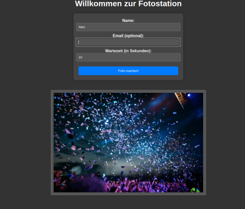

# AI PhotoBox

Build a photobox without a greenscreen!
This project uses the amazing [Backgroundremover](https://github.com/nadermx/backgroundremover) tool
to allow for easy photo boxes without a greenscreen. Simply setup a camera connected with gphoto2 and
create fun photos with your friends!

This script uses:

- Gphoto2 to capture images from a connected DSLR camera
- [Backgroundremover](https://github.com/nadermx/backgroundremover) to remove the background of the captured image
- Imagemagick to create variants of the source image
- mutt to send emails

## Example

Open the webinterface and enter information.
The photo will be taken and the background will be removed

Photo taken:

Foreground:

Combined image:

The photo will be saved in the 'done' folder and sent to the entered email adress.

## Installation

Install `gphoto2`, `imagemagick` and `mutt` using your package manager. Ensure that gphoto2 and mutt work correctly. Then run:

`pip install -r requirements.txt`

## Usage

`python webserver.py`
This starts a webserver on port 5000, which shows the last captured image and an interface to enter information.
Images are saved within subfolders in the 'done' folder, using the selected name. When mutt is configured and an email adress is entered, the image will also be sent to the entered email adress.

All photos in the `background` folder will be used as backgrounds.

## Configuration

In `greenscreen.sh` you can configure the following variables:

- do_resize: If set to true, the image will be resized. Use this, if background removal takes a long time and you want faster (but worse) results.
- resize_target: Target width of the resized image

## Image credits

Thanks to Prisicilla Du Preez for the photo:
https://unsplash.com/photos/three-women-walking-on-brown-wooden-dock-near-high-rise-building-during-daytime-mKJUoZPy70I

Also thanks thanks to Pablo Heimplatz for the background:
https://unsplash.com/de/fotos/menschen-die-mit-konfetti-feiern-ZODcBkEohk8
